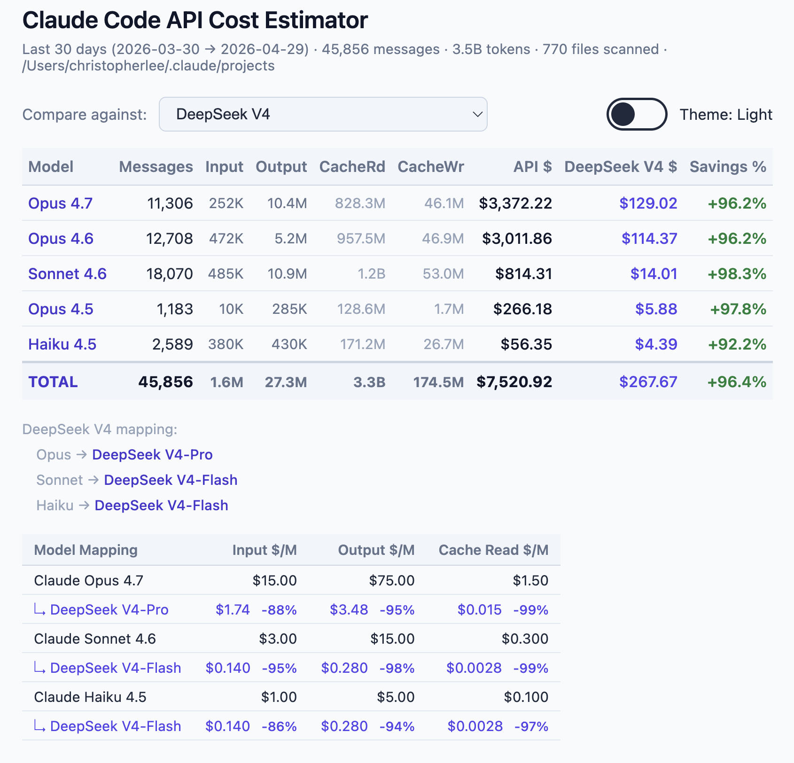

# claude-code-api-cost-estimator

Estimate your historical usage cost on **third-party API providers (DeepSeek, Qwen, Kimi, or GLM)**

Scans your local Claude Code sessions, buckets token usage to each provider's tiers, and calculates side-by-side cost comparison. 



## Quick start

```bash
npx github:chrisjunlee/claude-code-api-cost-estimator
```

The CLI starts a small local web server (default port 3000) and opens your browser to a comparison matrix.

> Requires Node.js 18 or newer.

If you'd rather clone and run:

```bash
git clone https://github.com/<your-username>/claude-code-api-cost-estimator
cd claude-code-api-cost-estimator
node bin/cli.mjs
```

## Flags

| Flag | Default | Description |
|---|---|---|
| `--port <n>` | `3000` | Port to listen on |
| `--days <n>` | `30` | Days of history to scan |
| `--projects-dir <path>` | `~/.claude/projects` | Where to find your `.jsonl` session files |
| `--no-open` | (off) | Don't auto-open the browser |
| `-h`, `--help` | | Show help |

Examples:

```bash
npx github:<your-username>/claude-code-api-cost-estimator --days 7
npx github:<your-username>/claude-code-api-cost-estimator --port 4123 --no-open
npx github:<your-username>/claude-code-api-cost-estimator --projects-dir /path/to/sessions
```

## What it does

Claude Code stores every session as a JSONL file under `~/.claude/projects/`. Each `assistant` line includes the model used and a `usage` block with `input_tokens`, `output_tokens`, `cache_read_input_tokens`, and cache-creation token counts.

This tool:

1. Walks `~/.claude/projects/**/*.jsonl` (last N days)
2. Aggregates per-model token usage
3. Multiplies tokens by prices from `pricing.json`
4. Renders a side-by-side comparison: native Anthropic API cost vs. each third-party provider

The Anthropic API column is the **baseline**, not the point. The whole tool exists to put third-party numbers next to it so you can see the real delta on *your* workload, not a marketing chart.

## Privacy

- All scanning and computation runs on your machine
- No transcripts, prompts, or token counts are sent anywhere
- The local server only binds to `localhost`

## Updating pricing

All prices live in `pricing.json` at the package root. Edit it and refresh the browser. The server re-reads the file on every request, no restart needed.

Per-model fields (`models`):
- `input` / `output`: USD per 1M tokens
- `cache_read`: USD per 1M cache-read tokens (falls back to `input` if omitted)
- `cache_write_5m` / `cache_write_1h`: USD per 1M cache-write tokens (fall back to `input`)
- `tiers`: array of `{ max_input_tokens, input, output }` for banded pricing (e.g. Qwen3-Max)
- `tier`: `"premium"` / `"standard"` / `"fast"` on Claude models; used for provider tier mapping
- `valid_until`: ISO date; shows a banner on the page while active

Provider entries (`providers`) let one dropdown option map Claude tiers to different underlying SKUs:

```json
"providers": {
  "deepseek-v4": {
    "displayName": "DeepSeek V4",
    "tierMap": { "premium": "deepseek-v4-pro", "standard": "deepseek-v4-flash", "fast": "deepseek-v4-flash" }
  }
}
```

`altOrder` can reference either a model key (flat single-SKU) or a provider key (tier-mapped).

## Contributing

Pricing changes and new providers are very welcome. Open a PR editing `pricing.json` with a link to the provider's official pricing page.

Provider pricing references currently used:

| Provider   | Pricing page |
|------------|-------------|
| Anthropic  | https://www.anthropic.com/pricing |
| DeepSeek   | https://api-docs.deepseek.com/quick_start/pricing |
| Alibaba    | https://www.alibabacloud.com/help/en/model-studio/models |
| Moonshot   | https://platform.kimi.ai/docs/pricing/chat-k2 |
| Zhipu Z.AI | https://docs.z.ai/guides/overview/pricing |

## Caveats

- Token counts come straight from Claude Code transcripts. Tokenizers differ across providers, so equivalent counts aren't perfectly equivalent.
- Cache-hit rates will vary in practice; the comparison assumes the same cache behaviour across all providers.

## License

MIT
